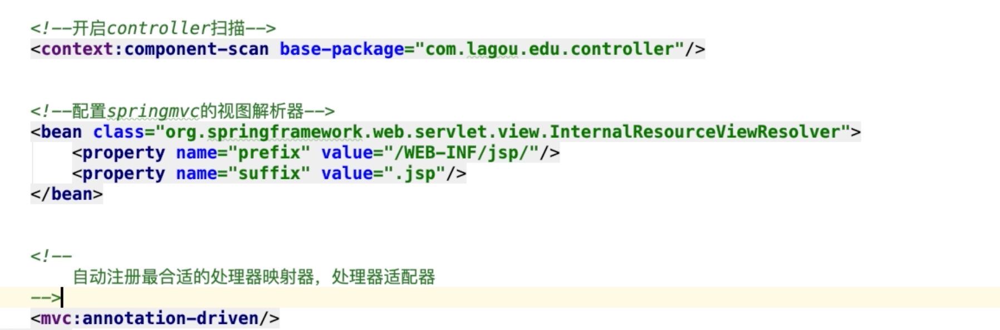

## SpringMVC

### 1.  SpringMVC基础回顾及高级深入

**Model（模型）**:模型包含业务模型和数据模型，数据模型⽤于封装数据，业务模型⽤于处理业务。

**View（视图）**: 通常指的就是我们的 jsp 或者 html。作⽤⼀般就是展示数据的。通常视图是依据模型数据创建

**Controller（控制器）**:是应⽤程序中处理⽤户交互的部分。作⽤⼀般就是处理程序逻辑的。MVC提倡：每⼀层只编写⾃⼰的东⻄，不编写任何其他的代码；分层是为了解耦，解耦是为了维护⽅便和分⼯协作

#### 1.1 springmvc处理请求方式

原生servlet处理客户端请求需要为每种业务编写servlet，比如UserServlet、OrderServlet。

**smvc全局只有一个DispatcherServlet。由这个servlet分配请求给具体的Controller去执行相应的业务逻辑，并且将处理的结果以model返回，再由DispatcherServlet渲染界面返回。如下图所示**


#### 1.2 处理请求流程


**流程说明**

> 第⼀步：⽤户发送请求⾄前端控制器DispatcherServlet
>
> 第⼆步：DispatcherServlet收到请求调⽤HandlerMapping处理器映射器
>
> 第三步：处理器映射器根据请求Url找到具体的Handler（后端控制器），⽣成处理器对象及处理器拦截器(如果 有则⽣成)⼀并返回DispatcherServlet
>
> 第四步：DispatcherServlet调⽤HandlerAdapter处理器适配器去调⽤Handler
>
> 第五步：处理器适配器执⾏Handler
>
> 第六步：Handler执⾏完成给处理器适配器返回ModelAndView
>
> 第七步：处理器适配器向前端控制器返回 ModelAndView，ModelAndView 是SpringMVC 框架的⼀个底层对 象，包括 Model 和 View
>
> 第⼋步：前端控制器请求视图解析器去进⾏视图解析，根据逻辑视图名来解析真正的视图。
>
> 第九步：视图解析器向前端控制器返回View
>
> 第⼗步：前端控制器进⾏视图渲染，就是将模型数据（在 ModelAndView 对象中）填充到 request 域
>
> 第⼗⼀步：前端控制器向⽤户响应结果


#### 1.3 简单程序开发

需求：前端请求 后端返回当前时间

开发步骤：

1. 在web.xml文件中配置DispatcherServlet前段控制器

2. 开发完成具体功能实现的@Controller、@RequestMapping业务类

3. 新建mvc配置xml。配置mvc三大件。HandlerMapping（处理器映射器）、HandlerAdapter（处理器适配器）、ViewResolver（视图解析器）



4. 将mvc三大件配置文件配置到DispatcherServlet中。


#### 1.4 mvc 九大组件

> 1. **HandlerMapping（处理器映射器）***

​		HandlerMapping 是⽤来查找 Handler 的，也就是处理器，具体的表现形式**可以是类，也可以是⽅法**。⽐如，标注了@RequestMapping的每个⽅法都可以看成是⼀个Handler。Handler负责具体实际的请求处理，在请求到达后，**HandlerMapping 的作⽤便是找到请求相应的处理器Handler 和 Interceptor.**

> 2. **HandlerAdapter（处理器适配器）***

​		HandlerAdapter 是⼀个适配器。**因为 Spring MVC 中 Handler 可以是任意形式的**，只要能处理请求即可。但是把请求交给 Servlet 的时候，由于 Servlet 的⽅法结构都是doService(HttpServletRequest req,HttpServletResponse resp)形式的，要让固定的 Servlet 处理⽅法调⽤ Handler 来进⾏处理，便是 HandlerAdapter 的职责。

> 3. **HandlerExceptionResolver (处理器异常解析器)**

​		HandlerExceptionResolver ⽤于处理 Handler 产⽣的异常情况。它的作⽤是根据异常设置ModelAndView，之后交给渲染⽅法进⾏渲染，渲染⽅法会将 ModelAndView 渲染成⻚⾯

> 4. **ViewResolver （视图解析器） ***

​		**⽤于将String类型的视图名和Locale解析为View类型的视图，**只有⼀个**resolveViewName**()⽅法。从⽅法的定义可以看出，Controller层返回的String类型视图名viewName 最终会在这⾥被解析成为View。View是⽤来渲染⻚⾯的，也就是说，它会将程序返回的参数和数据填⼊模板中，⽣成html⽂件。ViewResolver 在这个过程主要完成两件事情：ViewResolver 找到渲染所⽤的模板（第⼀件⼤事）和所⽤的技术（第⼆件⼤事，其实也就是找到视图的类型，如JSP）并填⼊参数。默认情况下，Spring MVC会⾃动配置⼀个InternalResourceViewResolver,是针对 JSP 类型视图的。

> 5. **RequestToViewNameTranslator (请求视图转换器)**

​		RequestToViewNameTranslator 组件的作⽤是从请求中获取 ViewName.因为 ViewResolver 根据ViewName 查找 View，**但有的 Handler 处理完成之后,没有设置 View，也没有设置 ViewName，便要通过这个组件从请求中查找 ViewName。**(处理就是将请求的路径当做逻辑视图名)。

> 6. **LocaleResolver （国际化解析器）**

​		ViewResolver 组件的 resolveViewName ⽅法需要两个参数，⼀个是视图名，⼀个是 Locale。LocaleResolver ⽤于从请求中解析出 Locale，⽐如中国 Locale 是 zh-CN，⽤来表示⼀个区域。这个组件也是 i18n 的基础。

> 7. **ThemeResolver (主题解析器)**

​		ThemeResolver 组件是⽤来解析主题的。主题是样式、图⽚及它们所形成的显示效果的集合。

> 8. **MultipartResolver (多元素解析器)**

​		**MultipartResolver ⽤于上传请求**，通过将普通的请求包装成 MultipartHttpServletRequest 来实现。MultipartHttpServletRequest 可以通过 getFile() ⽅法 直接获得⽂件。如果上传多个⽂件，还可以调⽤ getFileMap()⽅法得到Map<FileName，File>这样的结构，MultipartResolver 的作⽤就是封装普通的请求，**使其拥有⽂件上传的功能。**

> 9. **FlashMapManager (参数管理)**

​		**FlashMap ⽤于重定向时的参数传递**，⽐如在处理⽤户订单时候，为了避免重复提交，可以处理完post请求之后重定向到⼀个get请求，这个get请求可以⽤来显示订单详情之类的信息。这样做虽然可以规避⽤户重新提交订单的问题，但是在这个⻚⾯上要显示订单的信息，这些数据从哪⾥来获得呢？因为重定向时么有传递参数这⼀功能的，如果不想把参数写进URL（不推荐），那么就可以通过FlashMap来传递。只需要在重定向之前将要传递的数据写⼊请求（可以通过ServletRequestAttributes.getRequest()⽅法获得）的属性OUTPUT_FLASH_MAP_ATTRIBUTE中，这样在重定向之后的Handler中Spring就会⾃动将其设置到Model中，在显示订单信息的⻚⾯上就可以直接从Model中获取数据。**FlashMapManager 就是⽤来管理 FalshMap 的。**

#### 1.5 url-pattern 参数

> /*.abc  只匹配以.abc 结尾的请求
>
> /   不匹配.jsp (.jsp由web容器如tomcat处理)，但是会拦截.html、.css 等静态资源
>
> /*  拦截所有请求包括.jsp

##### 1.5.1 为什么配置为/会拦截静态资源？

​		因为tomcat容器中也有一个web.xml（父）。web项目中也有一个web.xml（子）。是一个继承关系。在父xml中有一个defaultServlet 其url-pattern也是一个/。web项目会复写父类中的配置，导致子xml（项目）拦截了静态资源。变成由项目的resolver去处理请求。从而导致查找不到静态资源的情况。

##### 1.5.2 为什么配置为/不拦截.jsp后缀的url？

​		因为在tomcat中web.xml有一个JspServlet。这个拦截器会拦截.jsp的请求。而我们并没有复写这个配置。所以spring-mvc此时不拦截.jsp结尾的请求，jsp的处理交给了tomcat容器

##### 1.5.3 如何解决配置为/拦截静态资源的的问题？

> **方案1**: 将静态资源处理重新交由外部容器处理
>
> ​		在配置文件中添加<mvc:default-servlet-handler />标签
>
> 原理:
>
> ​		添加该标签之后，会在spring-mvc上下文中定义一个DefaultServletHttpRequestHandler对象。这个对象会去检查对进入DispatcherServlet的请求。如果发现请求是一个静态资源，那么会将请求重新转发给外部的web容器（tomcat）默认的defaultServlet去处理。如果不是静态资源则继续由springmvc去处理


> **方案二**:  由springmvc自己处理静态资源**（推荐）**
>
> ​		在配置文件中增加静态资源的配置
>
> ​		<mvc:resources location="静态资源存放路径" mapping="需要当作静态资源的请求"/>


#### 1.6 请求参数处理

##### 1.6.1 默认支持Servlet Api作为方法参数

> 当需要使⽤HttpServletRequest、HttpServletResponse、HttpSession等原⽣servlet对象时，直接在handler⽅法中形参声明使⽤即可

```java
@RequestMapping("/handle")
public ModelAndView handle(HttpServletRequest request,
HttpServletResponse response,HttpSession session) {
  
}
```


##### 1.6.2 绑定简单数据类型

>整型：Integer、int
>
>字符串：String
>
>单精度：Float、flfloat
>
>双精度：Double、double
>
>布尔型：Boolean、boolean 说明：**对于布尔类型的参数，请求的参数值为true或false。或者1或0**

​				绑定简单数据类型参数，只需要直接声明形参即可（形参参数名和传递的参数名要保持⼀

致，建议 **使⽤包装类型**，当形参参数名和传递参数名不⼀致时可以使⽤@**RequestParam**注解进⾏

⼿动映射）

```java
@RequestMapping("/handle")
public ModelAndView handle03(@RequestParam("ids") Integer id,Boolean flag) {
}
```


##### 1.6.3 绑定Pojo包装对象参数

```java
/*
* SpringMVC接收pojo包装类型参数
* 不管包装Pojo与否，它⾸先是⼀个pojo，那么就可以按照上述pojo的要求来
* 1、绑定时候直接形参声明即可
* 2、传参参数名和pojo属性保持⼀致，如果不能够定位数据项，那么通过属性名 + "." 的⽅式进⼀步锁定数据
( url : /demo/handle05?user.id=1&user.username=zhangsan)
*/
@RequestMapping("/handle05")
public ModelAndView handle05(User user) {
		
}
public class User{
  private int id;
  private String userName;
}
```


##### 1.6.4 绑定⽇期类型参数（需要配置⾃定义类型转换器）

1. 当url里面传时间类型的时候需要手动添加一个时间类型转换器，将String转换成Date；

```java
public class DateConverter implements Converter<String, Date> {
  
@Override
public Date convert(String source) {
// 完成字符串向⽇期的转换
SimpleDateFormat simpleDateFormat = new SimpleDateFormat("yyyy-MM-dd");
try {
		Date parse = simpleDateFormat.parse(source);
		return parse;
 		} catch (ParseException e) {
		e.printStackTrace();
}
  return null;
}
}
```

2. 注册自定义类型转换

```xml
<!--
⾃动注册最合适的处理器映射器，处理器适配器(调⽤handler⽅法)
-->
<mvc:annotation-driven conversion-service="conversionServiceBean"/>
<!--注册⾃定义类型转换器-->
<bean id="conversionServiceBean"
class="org.springframework.format.support.FormattingConversionServiceFactoryBean"> 
  <property name="converters"> 
    <set>
			<bean class="com.lagou.edu.converter.DateConverter"></bean>
		</set>
	</property>
</bean>
```

#### 2. spring mvc高级技术

 **Spring容器和SpringMVC容器是有层次的（⽗⼦容器）**

 **Spring容器：service对象+dao对象**

 **SpringMVC容器：controller对象 可以引⽤到Spring容器中的对象**

#### 2.1 监听器、过滤器和拦截器对⽐

> **Servlet**：处理Request请求和Response响应
>
> **过滤器（Filter）**：对Request请求起到过滤的作⽤，**作⽤在Servlet之前**，如果配置为/*可以对所有的资源访问（servlet、js/css静态资源等）进⾏过滤处理
>
> **监听器（Listener）**：实现了javax.servlet.ServletContextListener 接⼝的服务器端组件，它随Web应⽤的启动⽽启动，只初始化⼀次，然后会⼀直运⾏监视，随Web应⽤的停⽌⽽销毁
>
> - 作⽤⼀：做⼀些初始化⼯作，web应⽤中spring容器启动ContextLoaderListener
>
> - 作⽤⼆：监听web中的特定事件，⽐如HttpSession,ServletRequest的创建和销毁；变量的创建、销毁和修改等。可以在某些动作前后增加处理，实现监控，⽐如统计在线⼈数，利⽤HttpSessionLisener等。
>
> **拦截器（Interceptor）**：**是SpringMVC、Struts等表现层框架⾃⼰的(前两个是javaEE的标准组件)**，不会拦截jsp/html/css/image的访问等，**只会拦截访问的控制器⽅法（Handler）**。从配置的⻆度也能够总结发现：**serlvet、fifilter、listener是配置在web.xml中的，⽽interceptor是配置在表现层框架⾃⼰的配置⽂件中的**
>
> - 在Handler业务逻辑执⾏之前拦截⼀次（preHandle）
>
> - 在Handler逻辑执⾏完毕但未跳转⻚⾯之前拦截⼀次（postHandle）
>
> - 在跳转⻚⾯之后拦截⼀次（afterCompletion）


#### 2.2 拦截器的执⾏流程


1. 程序先执⾏preHandle()⽅法，如果该⽅法的返回值为true，则程序会继续向下执⾏处理器中的⽅法，否则将不再向下执⾏。

2. 在业务处理器（即控制器Controller类）处理完请求后，会执⾏postHandle()⽅法，然后会通过DispatcherServlet向客户端返回响应。

3. 在DispatcherServlet处理完请求后，才会执⾏afterCompletion()⽅法。

**拦截器配置方法xml**

```xml
<mvc:interceptors>
        <!--拦截所有handler-->
        <!--<bean class="com.lagou.edu.interceptor.MyIntercepter01"/>-->
  
        <mvc:interceptor>
            <!--配置当前拦截器的url拦截规则，**代表当前目录下及其子目录下的所有url-->
            <mvc:mapping path="/**"/>
            <!--exclude-mapping可以在mapping的基础上排除一些url拦截-->
            <mvc:exclude-mapping path="/demo/**"/>
            <bean class="com.lagou.edu.interceptor.MyIntercepter01"/>
        </mvc:interceptor>
</mvc:interceptors>
```


#### 2.3  多个拦截器的执⾏流程

**Interceptor1在Interceptor2之前配置**


当有多个拦截器同时⼯作时，它们的preHandle()⽅法会按照配置⽂件中拦截器的配置

**顺序**执⾏，⽽它们的postHandle()⽅法和afterCompletion()⽅法则会按照配置顺序的**反序**执⾏。


#### 2.4 springmvc上传文件

1. 导入需要的依赖

```xml
<dependency> 
  <groupId>commons-fileupload</groupId> 
  <artifactId>commons-fileupload</artifactId> 
  <version>1.3.1</version>
</dependency>
```

2. 配置⽂件上传解析器(**id是固定的multipartResolver**,**mvc底层根据这个id获取对象**)

```xml
<!--配置⽂件上传解析器，id是固定的multipartResolver-->
<bean id="multipartResolver"
class="org.springframework.web.multipart.commons.CommonsMultipartResolver">
<!--设置上传⼤⼩，单位字节-->
<property name="maxUploadSize" value="1000000000"/>
</bean>
```

3. 后端接收实例handler

```java
@RequestMapping("upload")
public String upload(MultipartFile uploadFile, HttpServletRequest request)throws IOException {
    // ⽂件原名，如xxx.jpg
    String originalFilename = uploadFile.getOriginalFilename();
    // 获取⽂件的扩展名,如jpg
    String extendName =
    originalFilename.substring(originalFilename.lastIndexOf(".") + 1,
    originalFilename.length());
    String uuid = UUID.randomUUID().toString();
    // 新的⽂件名字
    String newName = uuid + "." + extendName;
    String realPath =
    request.getSession().getServletContext().getRealPath("/uploads");
    // 解决⽂件夹存放⽂件数量限制，按⽇期存放
    String datePath = new SimpleDateFormat("yyyy-MM-dd").format(new Date());
    File floder = new File(realPath + "/" + datePath);
    if(!floder.exists()) {
    floder.mkdirs();
 }
  uploadFile.transferTo(new File(floder,newName));
  return "success"; 
}
```


#### 2.5 handle 统一异常处理

```java
@ControllerAdvice
public class GlobalExceptionResolver {
  
    @ExceptionHandler(ArithmeticException.class)
    public ModelAndView handleException(ArithmeticException exception,
    			HttpServletResponse response) {
    		ModelAndView modelAndView = new ModelAndView();
    		modelAndView.addObject("msg",exception.getMessage());
    		modelAndView.setViewName("error");
    		return modelAndView;
 		}
}
```


### 3. 自定义mvc框架

#### 3.1 流程&思路


### 4.SSM整合开发

#### 4.1 整合规划

- 整合⽬标

  > 数据库连接池以及事务管理都交给Spring容器来完成
  >
  > SqlSessionFactory对象应该放到Spring容器中作为单例对象管理
  >
  > Mapper动态代理对象交给Spring管理，我们从Spring容器中直接获得Mapper的代理对象

- 整合所需 Jar 分析

  > Junit测试jar（4.12版本）
  >
  > Mybatis的jar（3.4.5）
  >
  > Spring相关jar（spring-context、spring-test、spring-jdbc、spring-tx、spring-aop、aspectjweaver）Mybatis/Spring整合包jar（mybatis-spring-xx.jar）
  >
  > Mysql数据库驱动jar
  >
  > Druid数据库连接池的jar

#### 4.2 基础整合配置

##### 4.2.1 Spring mybatis 配置

```xml
<?xml version="1.0" encoding="UTF-8"?>
<beans
	xmlns="http://www.springframework.org/schema/beans"
	xmlns:context="http://www.springframework.org/schema/context"
	xmlns:tx="http://www.springframework.org/schema/tx"
	xmlns:xsi="http://www.w3.org/2001/XMLSchema-instance"
xsi:schemaLocation="
http://www.springframework.org/schema/beans
http://www.springframework.org/schema/beans/spring-beans.xsd
http://www.springframework.org/schema/context
http://www.springframework.org/schema/context/spring-context.xsd
http://www.springframework.org/schema/tx
http://www.springframework.org/schema/tx/spring-tx.xsd
">
	<!--包扫描-->
	<context:component-scan base-package="com.lagou.edu.mapper"/>
	<!--数据库连接池以及事务管理都交给Spring容器来完成-->
	<!--引⼊外部资源⽂件-->
	<context:property-placeholder location="classpath:jdbc.properties"/>
	<!--第三⽅jar中的bean定义在xml中-->
	<bean id="dataSource" class="com.alibaba.druid.pool.DruidDataSource">
		<property name="driverClassName" value="${jdbc.driver}"/>
		<property name="url" value="${jdbc.url}"/>
		<property name="username" value="${jdbc.username}"/>
		<property name="password" value="${jdbc.password}"/>
	</bean>
	<!--SqlSessionFactory对象应该放到Spring容器中作为单例对象管理原来mybaits中sqlSessionFactory的构建是需要素材的：SqlMapConfig.xml中的内容
-->
	<bean id="sqlSessionFactory" class="org.mybatis.spring.SqlSessionFactoryBean">
		<!--别名映射扫描-->
		<property name="typeAliasesPackage" value="com.lagou.edu.pojo"/>
		<!--数据源dataSource-->
		<property name="dataSource" ref="dataSource"/>
	</bean>
	<!--Mapper动态代理对象交给Spring管理，我们从Spring容器中直接获得Mapper的代理对象-->
	<!--扫描mapper接⼝，⽣成代理对象，⽣成的代理对象会存储在ioc容器中-->
	<bean class="org.mybatis.spring.mapper.MapperScannerConfigurer">
		<!--mapper接⼝包路径配置-->
		<property name="basePackage" value="com.lagou.edu.mapper"/>
		<property name="sqlSessionFactoryBeanName" value="sqlSessionFactory"/>
	</bean>
  
  <!--包扫描-->
  <lgContext:component-scan base-package="com.lagou.edu.service"/>
  <!--事务管理-->
  <bean id="transactionManager"
  class="org.springframework.jdbc.datasource.DataSourceTransactionManager"> 
    <property name="dataSource" ref="dataSource"/>
  </bean>
  <!--事务管理注解驱动-->
  <tx:annotation-driven transaction-manager="transactionManager"/>
</beans>
```


##### 4.2.2 web.xml配置

 ```xml
<web-app>
	<display-name>Archetype Created Web Application</display-name>
	<context-param>
		<param-name>contextConfigLocation</param-name>
		<param-value>classpath*:applicationContext*.xml</param-value>
	</context-param>
	<!--spring框架启动-->
	<listener>
		<listener-class>org.springframework.web.context.ContextLoaderListener</listener-class>
	</listener>
	<!--springmvc启动-->
	<servlet>
		<servlet-name>springmvc</servlet-name>
		<servlet-class>org.springframework.web.servlet.DispatcherServlet</servlet-class>
		<init-param>
			<param-name>contextConfigLocation</param-name>
			<param-value>classpath*:springmvc.xml</param-value>
		</init-param>
		<load-on-startup>1</load-on-startup>
	</servlet>
	<servlet-mapping>
		<servlet-name>springmvc</servlet-name>
		<url-pattern>/</url-pattern>
	</servlet-mapping>
</web-app>
 ```


##### 4.2.3 springmvc.xml配置

```xml
<?xml version="1.0" encoding="UTF-8"?>
<beans
	xmlns="http://www.springframework.org/schema/beans"
	xmlns:context="http://www.springframework.org/schema/context"
	xmlns:mvc="http://www.springframework.org/schema/mvc"
	xmlns:xsi="http://www.w3.org/2001/XMLSchema-instance"
xsi:schemaLocation="http://www.springframework.org/schema/beans
http://www.springframework.org/schema/beans/spring-beans.xsd
http://www.springframework.org/schema/context
http://www.springframework.org/schema/context/springcontext.xsd
http://www.springframework.org/schema/mvc
http://www.springframework.org/schema/mvc/spring-mvc.xsd
">
	<!--扫描controller-->
	<context:component-scan base-package="com.lagou.edu.controller"/>
  <!--使用注解开发-->
	<mvc:annotation-driven/>
</beans>
```


## Spring JPA

### 1. 什么是jpa、spring jpa

JPA 是⼀套规范，内部是由接⼝和抽象类组成的，Hiberanate 是⼀套成熟的 ORM 框架，⽽且

Hiberanate 实现了 JPA 规范，所以可以称 Hiberanate 为 JPA 的⼀种实现⽅式，我们使⽤ JPA 的 API 编

程，意味着站在更⾼的⻆度去看待问题（⾯向接⼝编程）。

**Spring Data JPA 是 Spring 提供的⼀套对 JPA 操作更加⾼级的封装，是在 JPA 规范下的专⻔⽤来进⾏数**

**据持久化的解决⽅案。**


### 2. spring jpa使用

#### 2.1 spring jpa配置

 ```xml
<?xml version="1.0" encoding="UTF-8"?>
<beans
	xmlns="http://www.springframework.org/schema/beans"
	xmlns:context="http://www.springframework.org/schema/context"
	xmlns:jpa="http://www.springframework.org/schema/data/jpa"
	xmlns:xsi="http://www.w3.org/2001/XMLSchema-instance"
xsi:schemaLocation="
http://www.springframework.org/schema/beans
https://www.springframework.org/schema/beans/spring-beans.xsd
http://www.springframework.org/schema/context
https://www.springframework.org/schema/context/spring-context.xsd
http://www.springframework.org/schema/data/jpa
https://www.springframework.org/schema/data/jpa/spring-jpa.xsd
">
	<!--对Spring和SpringDataJPA进⾏配置-->
	<!--1、创建数据库连接池druid-->
	<!--引⼊外部资源⽂件-->
	<context:property-placeholder location="classpath:jdbc.properties"/>
	<!--第三⽅jar中的bean定义在xml中-->
	<bean id="dataSource" class="com.alibaba.druid.pool.DruidDataSource">
		<property name="driverClassName" value="${jdbc.driver}"/>
		<property name="url" value="${jdbc.url}"/>
		<property name="username" value="${jdbc.username}"/>
		<property name="password" value="${jdbc.password}"/>
	</bean>
	<!--2、配置⼀个JPA中⾮常重要的对象,entityManagerFactory
entityManager类似于mybatis中的SqlSession
entityManagerFactory类似于Mybatis中的SqlSessionFactory
-->
	<bean id="entityManagerFactory"
class="org.springframework.orm.jpa.LocalContainerEntityManagerFactoryBean">
		<!--配置⼀些细节.......-->
		<!--配置数据源-->
		<property name="dataSource" ref="dataSource"/>
		<!--配置包扫描（pojo实体类所在的包）-->
		<property name="packagesToScan" value="com.lagou.edu.pojo"/>
		<!--指定jpa的具体实现，也就是hibernate-->
		<property name="persistenceProvider">
			<bean class="org.hibernate.jpa.HibernatePersistenceProvider"></bean>
		</property>
		<!--jpa⽅⾔配置,不同的jpa实现对于类似于beginTransaction等细节实现
    起来是不⼀样的，
    所以传⼊JpaDialect具体的实现类-->
		<property name="jpaDialect">
			<bean class="org.springframework.orm.jpa.vendor.HibernateJpaDialect"></bean>
		</property>
		<!--配置具体provider，hibearnte框架的执⾏细节-->
		<property name="jpaVendorAdapter" >
			<bean class="org.springframework.orm.jpa.vendor.HibernateJpaVendorAdapter">
				<!--定义hibernate框架的⼀些细节-->
				<!--
        配置数据表是否⾃动创建
        因为我们会建⽴pojo和数据表之间的映射关系
        程序启动时，如果数据表还没有创建，是否要程序给创建⼀下
        -->
				<property name="generateDdl" value="false"/>
				<!--
        指定数据库的类型
        hibernate本身是个dao层框架，可以⽀持多种数据库类型
        的，这⾥就指定本次使⽤的什么数据库
        -->
				<property name="database" value="MYSQL"/>
				<!--
        配置数据库的⽅⾔
        hiberante可以帮助我们拼装sql语句，但是不同的数据库sql
        语法是不同的，所以需要我们注⼊具体的数据库⽅⾔
        -->
				<property name="databasePlatform"
value="org.hibernate.dialect.MySQLDialect"/>
				<!--是否显示sql
        操作数据库时，是否打印sql
        -->
				<property name="showSql" value="true"/>
			</bean>
		</property>
	</bean>
	<!--3、引⽤上⾯创建的entityManagerFactory
    <jpa:repositories> 配置jpa的dao层细节
    base-package:指定dao层接⼝所在包
    -->
	<jpa:repositories base-package="com.lagou.edu.dao" entity-manager-factory-ref="entityManagerFactory" transaction-manager-ref="transactionManager"/>
	<!--4、事务管理器配置
jdbcTemplate/mybatis 使⽤的是DataSourceTransactionManager
jpa规范：JpaTransactionManager
-->
	<bean id="transactionManager" class="org.springframework.orm.jpa.JpaTransactionManager">
		<property name="entityManagerFactory" ref="entityManagerFactory"/>
	</bean>
	<!--5、声明式事务配置-->
	<!--
<tx:annotation-driven/>
-->
	<!--6、配置spring包扫描-->
	<context:component-scan base-package="com.lagou.edu"/>
</beans>
 ```


#### 2.2 导入需要的依赖

```xml
<dependencies>
	<!--单元测试jar-->
	<dependency>
		<groupId>junit</groupId>
		<artifactId>junit</artifactId>
		<version>4.12</version>
		<scope>test</scope>
	</dependency>
	<!--spring-data-jpa 需要引⼊的jar,start-->
	<dependency>
		<groupId>org.springframework.data</groupId>
		<artifactId>spring-data-jpa</artifactId>
		<version>2.1.8.RELEASE</version>
	</dependency>
	<dependency>
		<groupId>javax.el</groupId>
		<artifactId>javax.el-api</artifactId>
		<version>3.0.1-b04</version>
	</dependency>
	<dependency>
		<groupId>org.glassfish.web</groupId>
		<artifactId>javax.el</artifactId>
		<version>2.2.6</version>
	</dependency>
	<!--spring-data-jpa 需要引⼊的jar,end-->
	<!--spring 相关jar,start-->
	<dependency>
		<groupId>org.springframework</groupId>
		<artifactId>spring-aop</artifactId>
		<version>5.1.12.RELEASE</version>
	</dependency>
	<dependency>
		<groupId>org.aspectj</groupId>
		<artifactId>aspectjweaver</artifactId>
		<version>1.8.13</version>
	</dependency>
	<dependency>
		<groupId>org.springframework</groupId>
		<artifactId>spring-context</artifactId>
		<version>5.1.12.RELEASE</version>
	</dependency>
	<dependency>
		<groupId>org.springframework</groupId>
		<artifactId>spring-context-support</artifactId>
		<version>5.1.12.RELEASE</version>
	</dependency>
	<!--spring对orm框架的⽀持包-->
	<dependency>
		<groupId>org.springframework</groupId>
		<artifactId>spring-orm</artifactId>
		<version>5.1.12.RELEASE</version>
	</dependency>
	<dependency>
		<groupId>org.springframework</groupId>
		<artifactId>spring-beans</artifactId>
		<version>5.1.12.RELEASE</version>
	</dependency>
	<dependency>
		<groupId>org.springframework</groupId>
		<artifactId>spring-core</artifactId>
		<version>5.1.12.RELEASE</version>
	</dependency>
	<!--spring 相关jar,end-->
	<!--hibernate相关jar包,start-->
	<dependency>
		<groupId>org.hibernate</groupId>
		<artifactId>hibernate-core</artifactId>
		<version>5.4.0.Final</version>
	</dependency>
	<!--hibernate对jpa的实现jar-->
	<dependency>
		<groupId>org.hibernate</groupId>
		<artifactId>hibernate-entitymanager</artifactId>
		<version>5.4.0.Final</version>
	</dependency>
	<dependency>
		<groupId>org.hibernate</groupId>
		<artifactId>hibernate-validator</artifactId>
		<version>5.4.0.Final</version>
	</dependency>
	<!--hibernate相关jar包,end-->
	<!--mysql 数据库驱动jar-->
	<dependency>
		<groupId>mysql</groupId>
		<artifactId>mysql-connector-java</artifactId>
		<version>5.1.46</version>
	</dependency>
	<!--druid连接池-->
	<dependency>
		<groupId>com.alibaba</groupId>
		<artifactId>druid</artifactId>
		<version>1.1.21</version>
	</dependency>
	<!--spring-test-->
	<dependency>
		<groupId>org.springframework</groupId>
		<artifactId>spring-test</artifactId>
		<version>5.1.12.RELEASE</version>
	</dependency>
</dependencies>
```

#### 2.3 jpa 注解说明

\* 实体类（在类中要使⽤注解建⽴实体类和数据表之间的映射关系以及属性和字段的映射关系）*

\* 1、实体类和数据表映射关系

\* @Entity

\* @Table

\* 2、实体类属性和表字段的映射关系

\* @Id 标识主键

\* @GeneratedValue 标识主键的⽣成策略

> \* ⽣成策略经常使⽤的两种：
>
> \* GenerationType.IDENTITY:依赖数据库中主键⾃增功能 Mysql
>
> \* GenerationType.SEQUENCE:依靠序列来产⽣主键 Oracle

\* @Column 建⽴属性和字段映射


#### 2.4 符合jpa规范的接口实现

```java
package com.lagou.edu.dao;
import com.lagou.edu.pojo.Resume;
import org.springframework.data.jpa.repository.JpaRepository;
import org.springframework.data.jpa.repository.JpaSpecificationExecutor;
import org.springframework.data.jpa.repository.Query;
import java.util.List;
/**
* ⼀个符合SpringDataJpa要求的Dao层接⼝是需要继承JpaRepository和
JpaSpecificationExecutor
*
* JpaRepository<操作的实体类类型,主键类型>
* 封装了基本的CRUD操作
*
* JpaSpecificationExecutor<操作的实体类类型>
* 封装了复杂的查询（分⻚、排序等）
*
*/
public interface ResumeDao extends JpaRepository<Resume,Long>,
JpaSpecificationExecutor<Resume> {
  
    @Query("from Resume where id=?1 and name=?2")
    public List<Resume> findByJpql(Long id,String name);
    /**
    * 使⽤原⽣sql语句查询，需要将nativeQuery属性设置为true，默认为false（jpql）
    * @param name
    * @param address
    * @return
    */
    @Query(value = "select * from tb_resume where name like ?1 and address like ?2",nativeQuery = true)
    public List<Resume> findBySql(String name,String address);
    /**
    * ⽅法命名规则查询
    * 按照name模糊查询（like）
    * ⽅法名以findBy开头
    * -属性名（⾸字⺟⼤写）
    * -查询⽅式（模糊查询、等价查询），如果不写查询⽅式，默认等价
    查询
    */
    public List<Resume> findByNameLikeAndAddress(String name,String
    address);
}
```

#### 2.5 问题：执行删除操作的时候只执行了查询，没有执行删除操作

比如执行deleteById(id),在控制台上只能看到，select XXX where Id = ?,并没有正常执行delete from XXX，

确认查询到的数据是存在的。

原因：需要使用jpa的事务管理器 

```xml
<bean id="transactionManager" class="org.springframework.orm.jpa.JpaTransactionManager">
    <property name="entityManagerFactory" ref="entityManagerFactory"/>
</bean>
```

不能使用

```xml
 <!--事务管理-->
    <bean id="transactionManager"  				class="org.springframework.jdbc.datasource.DataSourceTransactionManager">
        <property name="dataSource" ref="dataSource"/>
    </bean>

    <!--事务管理注解驱动-->
    <tx:annotation-driven transaction-manager="transactionManager"/>

```

#### 2.6 使用jpql查询

**jpql类似于sql，只不过sql查询的是数据表和字段，而jpql操作的是对象和属性，**

比如 from Resume where id = xx

这种语言在hibernate中叫hql。

用法：

```java
@Query("from Resume where id=?1 and name=?2")
public List<Resume> findByJpql(Long id,String name);
```


#### 2.7 使用sql查询

使⽤原⽣sql语句查询，**需要将nativeQuery属性设置为true**，默认为false（jpql）

用法：

```java
@Query(value = "select * from tb_resume where name like ?1 and address like ?2",
       nativeQuery = true)
public List<Resume> findBySql(String name,String address);
```


#### 2.8 关于jpa查询方式分析

> ========================针对查询的使⽤进⾏分析=======================
>
>- 调⽤继承的接⼝中的⽅法 findOne(),findById()
>
>- 可以引⼊jpql（jpa查询语⾔）语句进⾏查询 (=====>>>> jpql 语句类似于sql，只不过sql操作的是数据表和字段，jpql操作的是对象和属性，⽐如 from Resume where id=xx) hql
>
>- 可以引⼊原⽣的sql语句,nativeQuery属性设置为true
>
>- 可以在接⼝中⾃定义⽅法，⽽且不必引⼊jpql或者sql语句，这种⽅式叫做⽅法命名规则查询，也就是说定义的接⼝⽅法名是按照⼀定规则形成的，那么框架就能够理解我们的意图
>
>  ```java
>  @Test
>  public void testMethodName(){
>      List<Resume> list = resumeDao.findByNameLikeAndAddress("李%","上 海");
>      for (int i = 0; i < list.size(); i++) {
>      Resume resume = list.get(i);
>      System.out.println(resume);
>      }
>  }
>  ```
>
>  
>
>- 动态查询  service层传⼊dao层的条件不确定，把service拿到条件封装成⼀个对象传递给
>  Dao层，这个对象就叫做Specification（对条件的⼀个封装）
>
>  ```java
>  @Test
>  public void testSpecficationMultiCon(){
>  /**
>  * 需求：根据name（指定为"张三"）并且，address 以"北"开头（模糊匹
>  配），查询简历
>  */
>  Specification<Resume> specification = new Specification<Resume>(){
>      @Override
>      public Predicate toPredicate(Root<Resume> root,
>      CriteriaQuery<?> criteriaQuery, CriteriaBuilder criteriaBuilder) {
>            // 获取到name属性
>            Path<Object> name = root.get("name");
>            Path<Object> address = root.get("address");
>            // 条件1：使⽤CriteriaBuilder针对name属性构建条件（精准查询）
>            Predicate predicate1 = criteriaBuilder.equal(name, "张三");
>            // 条件2：address 以"北"开头（模糊匹配）
>            Predicate predicate2 =
>            criteriaBuilder.like(address.as(String.class), "北%");
>            // 组合两个条件
>            Predicate and = criteriaBuilder.and(predicate1,
>            predicate2);
>            return and;
>        }
>      };
>      Optional<Resume> optional = resumeDao.findOne(specification);
>      Resume resume = optional.get();
>      System.out.println(resume);
>   }
>  }
>  ```

