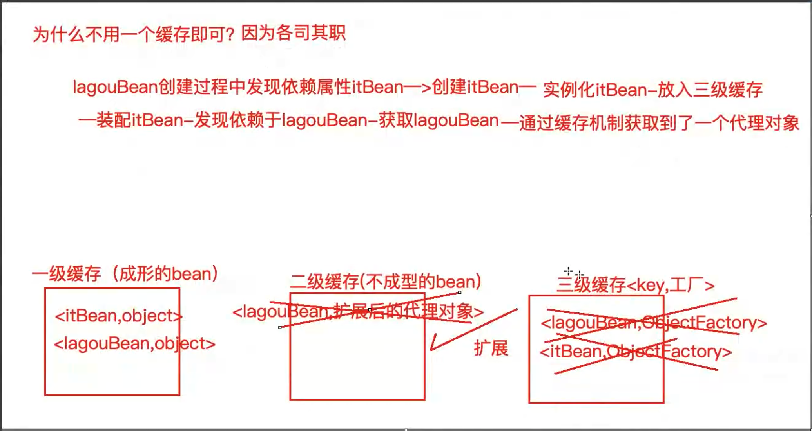
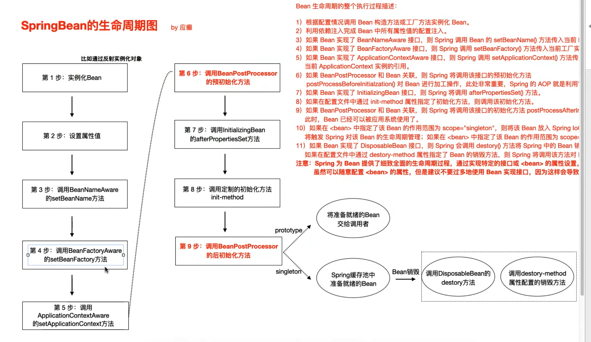
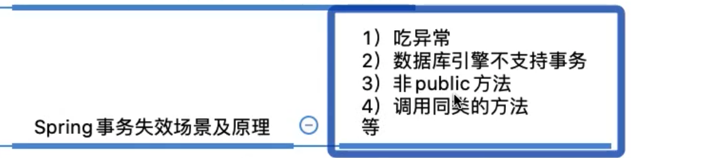
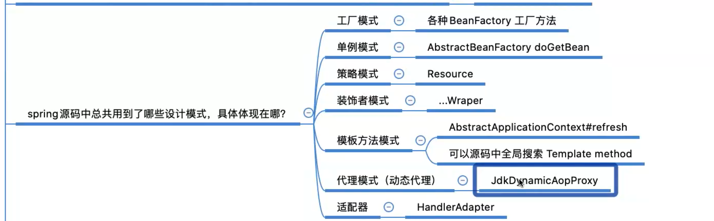
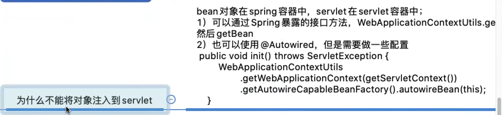

### 1.spring 框架优势

> - 方便解耦，简化开发（将对象的依赖关系交由spring控制）
> - aop编程
> - 声明式事务管理
> - 方便程序的测试
> - 方便其他各类优秀框架的集成


### 2.spring核心思想

- 注意：ioc和aop不是spring提出的，在这之前已经存在，只不过偏向于理论，后由spirng做了很好的实现

#### 2.1 什么是ioc

> **ioc（inversion of control） 控制反转/反转控制。这是一个技术思想，不是技术实现**
>
> - **控制**：指对对象的创建和管理的权限
> - **反转**：控制权交给spring ioc

> **描述：java 开发领域对象的创建、管理的问题**
>
> - **传统开发方式**：B依赖于A 则在B中new一个A
>
> - **ioc方式**：不需要new，由ioc实例化（丧失了创建和管理对象的权利，得到了不需要创建管理的福利）

####  2.2 ioc与di的区别

**ioc和di描述的是同一件事情，只是站的角度不同**

> ioc：站在对象角度，对象的实例化和管理交给了容器。

> di：站在容器的角度，容易会把对象依赖的其他对象注入。


### 3.aop 编程

#### 3.1 什么是aop编程

>  **aop：Aspect oriented programming 面向切面编程（纵向流程）**
>
>  **oop：Object Oriented Programming 面向对象编程（垂直纵向的继承体系）**

aop是oop的延续 使用场景比较有限 一般是事务控制，权限校验或者日志等

oop三大特征：封装、继承、多态。oop的编程方法可以解决大多数代码重复问题，但是有一些情况是处理不了的，比如在顶级父类中出现重复代码*（如果需要记录每个方法的执行时间的话，记录代码就必须和业务代码耦合）*

#### 3.2 aop解决了什么问题

*在不改变原有业务代码逻辑的情况下，增强横切逻辑代码，解决代码的耦合、重复问题。*


###  4.自定义ioc

 **需要解决的问题思考：**

> 使用new关键字创建对象的实例，存在代码的强耦合。
>
> 解决办法：
>
> - 使用反射机制，Class.forName("全限定类名") 创建对象实例。并且使用xml的配置模式，解决耦合问题。
> - 使用工厂模式读取解析xml配置，配合反射技术生产对象实例

**任务分解：**

- 读取xml配置文件 通过反射实例化对象存储待用
- 工厂类提供接口通过name获取对象实例


### 5.数据库事务

#### 5.1 数据库事务存在的两个问题

数据库事务本质上是Connection的事务

- Connection.commit() 提交事务
- Connection.rollback() 回滚事务

1. 两次update 如果使用两个不同的Connection，则两次update肯定不是同一个事务。

2. 如果要实现业务的事务管理，则需要将事务从原来的dao层迁移到service层。**所以事务控制需要添加到service层**

解决办法：

#### 5.2 Connection不一致问题解决

> 需要让两次update获取到的Connection为同一个。**使用TreadLocal存储当前线程使用的Connection。**在当前线程使用Connection时都从ThreadLocal中获取，从而保证每次使用的Connection都是同一个。

```java
//需要单例模式，因为如果重新new出来一个util的话内部的ThreadLocal也是新的。
public class ConnectionUtil{
  //私有化构造函数，使new失效
  private ConnectionUtil(){}
  
  //使用饿汉式单例模式 需要用static final修饰
  static final ConnectionUtil util = new ConnectionUtil();
  public static ConnectionUtil getInstance(){
    return util;
  }
  
  //使用懒汉式单例模式 注： getInstance需要添加synchronized，
  //否则当两个线程一起获取时可能同时获取到null，然后new出来两个util
  /**
  	private static Connection conn；
  	public static synchronized ConnectionUtil getInstance(){
  		if(conn == null){
  			conn = new ConnectionUtil();
  		}
  		return conn;
  	}
  **/
  ThreadLocal<Connection> threadLocal = new ThreadLocal<>();
  public Connection getCurrentConnection(){
    //从线程中获取Connection 如果没有则从线程池中获取一个新的连接并保存到TreadLocal中
    Connection conn = threadLocal.get();
    if(conn == null){
      //获取一个新的连接
      conn = DataSourceUtil.getConnection();
      //设置线程保存的Connection
      treadLocal.set(connNew);
    }
    return conn;
  }
}

```

#### 5.3.事务管理由dao层迁移到service层

> **使用try{}catch()执行业务代码，如果发生错误则rollback。如果成功则commit**

```java
try{
 	//关闭Connection事务的自动提交
  conn.setAutoCommit(false);
  //业务代码……
  doSomeThing();
  //提交事务
  getCurrentConnection().commit();
}catch(Exception e){
  //打印业务异常
  e.printStackTrace();
  //事务回滚
  getCurrentConnection().rollback();
  //抛出业务异常
  throw e;
}
```

#### 5.4 问题5.3解决进阶（代理）

> 思考：**5.3解决办法事务代码与业务代码强耦合**

##### 5.4.1**静态代理**

> ```java
> //一个接口
> public interface IHello(){
>   String sayHello();
> }
> 
> //一个实现类 中国人说您好
> public class ChineseHello implements IHello{
>   @Override
>   public String sayHello(){
>     return "您好";
>   }
> }
> 
> //一个代理类 英语代理为中国人翻译你好 返回hello
> public class EnglishProxy implements IHello{
>   private IHello iHello;
>   
>   public void setIHello(IHello iHello){
>     this.iHello = iHello;
>   }
>   
>   @Override
>   public String sayHello(){
>     return translate(iHello.sayHello());
>   }
> }
> 
> //调用
> public static void main(String[] args){
>   	IHello iHello = new ChineseHello();
>     EnglishProxy proxy = new EnglishProxy();
> 		//调用代理的方法实现翻译的增强
>   	proxy.setIHello(iHello);
>   	//代理翻译 打印hello；
>   	System.out.print(proxy.sayHello());
> }
> ```

##### 5.4.2 动态代理（JDK）

使用jdk动态代理实现 

**动态代理与静态代理的区别是不需要再写静态的代理类（EnglishProxy）**

```java
public static void main(String[] args){
  IHello iHello = new ChineseHello();
  //获取代理对象
  IHello proxy = (IHello)Proxy.newProxyInstance(iHello.getClass().getClassLoader(),
                                      iHello.getClass.getInterfaces(),
                          new InvocationHandler(){
                          /**
                          proxy代理对象本身
                          Method代理类的方法
                          args 方法的参数值
                          **/
                          @Override
                          public Object invoke(Object proxy,Method method,Object[] args){
                            //调用原有委托对象方法
                            Object o = method.invoke(iHello,args);
                            //实现翻译的增强
                            return translate(o);
                          }
                     });
  //执行代理对象的方法
  proxy.sayHello();
}
```

**更进一步：可以封装一个动态代理生产工厂ProxyFactory**

```java
public class ProxyFactory{
  private ProxyFactory(){}
  private ProxyFactory proxyFactory = new ProxyFactory();
  public static ProxyFactory getInstance(){
    return proxyFactory;
  }
  /**
  参数 obj 需要代理的对象
  返回 代理对象
  **/
  public Object getProxy(Object obj){
    return Proxy.newProxyInstance(obj.getClass().getClassLoader(),
                                      obj.getClass.getInterfaces(),
                          new InvocationHandler(){
                          @Override
                          public Object invoke(Object proxy,Method method,Object[] args){
                           		//调用原方法并且可以实现增强
                          }
                     });
  }
}

public static void main(String[] args){
  	IHello ihello = (IHello)ProxyFactory.getInstance().getProxy(new ChineseHello());
  	ihello.sayHello();
}
```

##### 5.4.3 动态代理（CGLib）

```java
public static void main(String[] args){
  	IHello iHello = new ChineseHello();
  	IHello ihello = (IHello)Enhancer.create(
      iHello.getClass,
      new MethodInterceptor(){
        @Override
        public Object interceptor(Object o,
                                  Method method,
                                  Object[] args,
                                  MethodProxy methodProxy) throw Throwable{
          	//调用原方法并且可以实现增强
        }
      }
    )
}
```


##### 5.4.4 JDK和CGLib动态代理区别

>  (1) JDK动态代理只能对实现了接口的类生成代理，**而不能针对类**
>  (2) CGLIB是针对类实现代理，主要是对指定的类生成一个子类，覆盖其中的方法
>  **因为是继承，所以该类或方法最好不要声明成final **


### 6.spring IoC的使用

**Spring IoC实例化bean的三种方式**

> 1.使用无参构造器（推荐）
>
> ```xml
> <bean id="test" class="XXXX.Test" ></bean>
> ```

以下两种是为了我们自己new出来的对象加到SpringIoC容器中

> 2.静态方法
>
> ```java
> class Test{
> 	public static Test getTest(){
> 		return new Test();
>   }
> }
> ```
>
> 对应配置xml
>
> ```xml
> <bean id="test" class="XXXX.Test" factory-method="getTest"></bean>
> ```

> 3.实例化方法 和2的区别是返回的方法是非static的
>
> 其实就是使用其他bean的方法非静态方法返回一个目标bean
>
> ```java
> public class Test{
>   
> }
> public class BeanFactory{
>   public Test getTest(){
>     return new Test();
>   }
> }
> ```
>
> ```xml
> <bean id="beanFactory" class="xxx.BeanFactory"/>
> <bean id="test" class="xxxx.Test" factory-bean="beanFactory" factory-method="getTest"/>
> ```


#### 6.1 启动IoC的方式


​		BeanFactory 是Spring框架IoC的顶层接口，它只用来定义一些基础功能，定义一些基础规范。而	ApplicationContent是他的一个子接口，所以ApplicationContent包含BeanFactory提供的所有功能。

- **jave环境下**

> ClassPathXmlApplicationContext：从类的根路径下加载配置⽂件（推荐使⽤）
>
> FileSystemXmlApplicationContext：从磁盘路径上加载配置⽂件
>
> AnnotationConfifigApplicationContext：纯注解模式下启动Spring容器


- web环境下

> - 从xml启动
>
> ```xml
> <!DOCTYPE web-app PUBLIC
> "-//Sun Microsystems, Inc.//DTD Web Application 2.3//EN"
> "http://java.sun.com/dtd/web-app_2_3.dtd" >
> <web-app> 
>   <display-name>Archetype Created Web Application</display-name>
>   
> <!--配置Spring ioc容器的配置⽂件-->
> <context-param> 
>   <param-name>contextConfigLocation</param-name> 
>   <param-value>classpath:applicationContext.xml</param-value>
> </context-param>
>   
> <!--使⽤监听器启动Spring的IOC容器-->
> <listener> 
>   <listener-class>org.springframework.web.context.ContextLoaderListener</listener-class>
> </listener>
> </web-app>
> ```
>
> - 从配置类中启动
>
>   ```xml
>   <!DOCTYPE web-app PUBLIC
>   "-//Sun Microsystems, Inc.//DTD Web Application 2.3//EN"
>   "http://java.sun.com/dtd/web-app_2_3.dtd" >
>   <web-app> 
>    	<display-name>Archetype Created Web Application</display-name>
>     
>   	<!--告诉ContextloaderListener知道我们使⽤注解的⽅式启动ioc容器-->
>   	<context-param> 
>       <param-name>contextClass</param-name> 				
>       <param-value>org.springframework.web.context.support.AnnotationConfigWebAppli
>   cationContext</param-value>
>   	</context-param>
>     
>   <!--配置启动类的全限定类名-->
>   	<context-param>
>       <param-name>contextConfigLocation</param-name> 
>       <param-value>com.lagou.edu.SpringConfig</param-value>
>   </context-param>
>   <!--使⽤监听器启动Spring的IOC容器-->
>   <listener> 
>     <listener-class>org.springframework.web.context.ContextLoaderListener</listener-class>
>   </listener>
>   </web-app>
>   ```

#### 6.2 Bean作用范围和生命周期

- singleton：单例的（默认值）IoC容器中指存在一个该对象的实例

- prototype：多例的 每次getBean的时候都返回一个新的对象实例

- request：作用于web应用的请求范围

- session：作用于web应用的会话范围

- global-session：作用于集群环境的会话范围（全局会话范围），当不是集群环境时，它就是session

  

**实际开发中⽤到最多的作⽤范围就是 singleton（单例模式）和 prototype（原型模式，也叫多例模式）**

> 单例模式：**singleton**
>
> 对象出⽣：当创建容器时，对象就被创建了。
>
> 对象活着：只要容器在，对象⼀直活着。
>
> 对象死亡：当销毁容器时，对象就被销毁了。
>
> **⼀句话总结：单例模式的bean对象⽣命周期与容器相同。**

> 多例模式：**prototype**
>
> 对象出⽣：当使⽤对象时，创建新的对象实例。
>
> 对象活着：只要对象在使⽤中，就⼀直活着。
>
> 对象死亡：当对象⻓时间不⽤时，被java的垃圾回收器回收了。
>
> **⼀句话总结：多例模式的bean对象，spring框架只负责创建，不负责销毁。**


#### 6.3 **xml**与注解相结合模式


| **xml**形式              | 对应的注解形式                                               |
| ------------------------ | ------------------------------------------------------------ |
| 标签                     | @Component("accountDao")，注解加在类上bean的id属性内容直接配置在注解后⾯如果不配置，默认定义个这个bean的id为类的类名⾸字⺟⼩写；另外，针对分层代码开发提供了@Componenet的三种别名@Controller、@Service、@Repository分别⽤于控制层类、服务层类、dao层类的bean定义，这四个注解的⽤法完全⼀样，只是为了更清晰的区分⽽已 |
| 标签的scope属性          | @Scope("prototype")，默认单例，注解加在类上                  |
| 标签的init-method属性    | @PostConstruct，注解加在⽅法上，该⽅法就是初始化后调⽤的⽅法 |
| 标签的destory-method属性 | @PreDestory，注解加在⽅法上，该⽅法就是销毁前调⽤的⽅法      |

**注解以及作用**

> - **@Autowired** 自动注入bean，采取的策略为按照类型注⼊。
>
> - **@Qualififier**  告诉Spring具体去装配哪个对象。@Qualifier(name="jdbcAccountDaoImpl") 
>
> - **@Resource** 默认按照 ByName ⾃动注⼊ @Resource(name="manDao",type="ManDao") 
>
>   该注解 在 Jdk 11中已经移除，如果要使⽤，需要单独引⼊jar包


使用注解的方式需要在xml中配置扫描注解的base-package

```xml
<context:component-scan base-package="包路径"/>
```

xml中引入外部资源

```xml
<context:property-placeholder location="配置文件路径"/>
<!--引入后可以直接是用${}占位符使用属性-->
<property name="xxx" value="${xxx}"/>
```


#### 6.4 纯注解方式

**将xml中遗留的配置内容迁移出去，从配置类中启动程序，最终删除xml文件**

@Confifiguration 注解，表名当前类是⼀个配置类

@ComponentScan 注解，扫描的包 替代 context:component-scan

@PropertySource，引⼊外部属性配置⽂件

@Import 引⼊其他配置类 从而在配置启动类的时候可以只配置一个类

@Value 对变量赋值，可以直接赋值，也可以使⽤ ${} 读取资源配置⽂件中的信息

@Bean 将⽅法返回对象加⼊ SpringIOC 容器


### 7.Spring IoC高级特性

#### 7.1 lazy-init 延迟加载(singleton bean)

​		如果不想让⼀个singleton bean 在 ApplicationContext实现初始化时被提前实例化，那么可以将bean

设置为延迟实例化。

 ```xml
<bean id="testBean" calss="cn.lagou.LazyBean" lazy-init="true" />
 ```

​		设置 lazy-init 为 true 的 bean 将不会在 ApplicationContext 启动时提前被实例化，⽽是第⼀次向容器

通过 getBean 索取 bean 时实例化的。

​		如果⼀个设置了⽴即加载的 bean1，引⽤了⼀个延迟加载的 bean2 ，那么 bean1 在容器启动时被实例

化，⽽ bean2 由于被 bean1 引⽤，所以也被实例化，这种情况也符合延时加载的 bean 在第⼀次调⽤

时才被实例化的规则

​		也可以在容器层次中通过在 元素上使⽤ "default-lazy-init" 属性来控制延时初始化。如下⾯配置：

```xml
<beans default-lazy-init="true">

<!-- no beans will be eagerly pre-instantiated... -->

</beans>
```

​		如果⼀个 bean 的 scope 属性为 scope="pototype" 时，即使设置了 lazy-init="false"，容器启动时也不

会实例化bean，⽽是调⽤ getBean ⽅法实例化的。

开启延迟加载的优点

1. 一定程度提高容器启动和运转性能
2. 对于不常用的bean可以在使用的时候在加载，而不在一开始就占用资源


#### 7.2 FactoryBean和BeanFactory

**BeanFactory**

>  BeanFactory接⼝是容器的顶级接⼝，定义了容器的⼀些基础⾏为，负责⽣产和管理Bean的⼀个⼯⼚，
>
> 具体使⽤它下⾯的⼦接⼝类型，⽐如ApplicationContext


**FactoryBean(完成复杂Bean的定义)**

> Spring中Bean有两种，⼀种是普通Bean，⼀种是⼯⼚Bean（FactoryBean），FactoryBean可以⽣成
>
> 某⼀个类型的Bean实例（返回给我们），也就是说我们可以借助于它**⾃定义**Bean的创建过程。

```java
// 可以让我们⾃定义Bean的创建过程（完成复杂Bean的定义）
public interface FactoryBean<T> {
  
  // 返回FactoryBean创建的Bean实例，如果isSingleton返回true，
  //则该实例会放到Spring容器的单例对象缓存池中Map
	@Nullable
	T getObject() throws Exception;
  
  // 返回FactoryBean创建的Bean类型
	@Nullable
	Class<?> getObjectType();
  
  // 返回作⽤域是否单例
	default boolean isSingleton() {
			return true; 
  } 
}
```


#### 7.3 后置处理器(BeanPostProcessor 和 BeanFactoryPostProcessor)

​		spring提供两种后处理bean的扩展接口，分别为BeanPostProcessor和 BeanFactoryPostProcessor，**两者在使用上是有区别的**

工厂初始化 -> BeanFactoryPostProcessor -> bean对象初始化 -> BeanPostProcessor

BeanFactoryPostProcessor:

> **在BeanFactory初始化之后可以使⽤BeanFactoryPostProcessor进⾏后置处理做⼀些事情**

BeanPostProcessor:

> **在Bean对象实例化（并不是Bean的整个⽣命周期完成）之后可以使⽤BeanPostProcessor进⾏后置处**
>
> **理做⼀些事情**


### 8. **Spring IoC**容器初始化主体流程

​		**Spring IoC 容器初始化的关键环节就在 AbstractApplicationContext#refresh() ⽅法中，我们查看 refresh ⽅法来俯瞰容器创建的主体流程**

```java
@Override
public void refresh() throws BeansException, IllegalStateException {
synchronized (this.startupShutdownMonitor) {
// 第⼀步：刷新前的预处理
prepareRefresh();
/*
第⼆步：
获取BeanFactory；默认实现是DefaultListableBeanFactory
加载BeanDefition 并注册到 BeanDefitionRegistry
*/
ConfigurableListableBeanFactory beanFactory =
obtainFreshBeanFactory();
// 第三步：BeanFactory的预准备⼯作（BeanFactory进⾏⼀些设置，⽐如context的类加
载器等）
prepareBeanFactory(beanFactory);
try {
// 第四步：BeanFactory准备⼯作完成后进⾏的后置处理⼯作
postProcessBeanFactory(beanFactory);
// 第五步：实例化并调⽤实现了BeanFactoryPostProcessor接⼝的Bean
invokeBeanFactoryPostProcessors(beanFactory);
// 第六步：注册BeanPostProcessor（Bean的后置处理器），在创建bean的前后等执
⾏
registerBeanPostProcessors(beanFactory);
// 第七步：初始化MessageSource组件（做国际化功能；消息绑定，消息解析）；
initMessageSource();
// 第⼋步：初始化事件派发器
initApplicationEventMulticaster();
// 第九步：⼦类重写这个⽅法，在容器刷新的时候可以⾃定义逻辑
onRefresh();
// 第⼗步：注册应⽤的监听器。就是注册实现了ApplicationListener接⼝的监听器
registerListeners();
/*
第⼗⼀步：
初始化所有剩下的⾮懒加载的单例bean
初始化创建⾮懒加载⽅式的单例Bean实例（未设置属性）
填充属性
初始化⽅法调⽤（⽐如调⽤afterPropertiesSet⽅法、init-method⽅法）
调⽤BeanPostProcessor（后置处理器）对实例bean进⾏后置处
*/
finishBeanFactoryInitialization(beanFactory);
/*
第⼗⼆步：
完成context的刷新。主要是调⽤LifecycleProcessor的onRefresh()⽅法，并且发布事
件 （ContextRefreshedEvent）
*/
finishRefresh();
 }
 ......
 }
}
```

### 9.spring理论

#### 9.1 lazy-init延迟加载原理

​		普通 Bean 的初始化是在容器启动初始化阶段执⾏的，⽽被lazy-init=true修饰的 bean 则是在从**容器⾥第⼀次进⾏context.getBean() 时进⾏触发**。Spring 启动的时候会把所有bean信息(包括XML和注解)解析转化成Spring能够识别的BeanDefifinition并存到Hashmap⾥供下⾯的初始化时⽤，然后对每个BeanDefifinition 进⾏处理，如果是懒加载的则在容器**初始化阶段不处理**，其他的则在容器初始化阶段进⾏初始化并依赖注⼊。

#### 9.2 循环依赖处理

Spring中循环依赖场景有：

- 构造器的循环依赖（构造器注⼊）

- Field 属性的循环依赖（set注⼊）

其中，**构造器的循环依赖问题⽆法解决**，只能拋出 BeanCurrentlyInCreationException 异常，在解决属性循环依赖时，spring采⽤的是**提前暴露对象**的⽅法。

> **spring无法解决下面两种情况**
>
> - 单例 bean 构造器参数循环依赖 
>
> - prototype 原型 bean循环依赖（原型bean不被spring容器管理）

> **spring能处理的循环依赖**
>
> ​	Spring通过setXxx或者@Autowired⽅法解决循环依赖其实是通过提前暴露⼀个ObjectFactory对象来完成的，简单来说ClassA在调⽤构造器完成对象初始化之后，在调⽤ClassA的setClassB⽅法之前就把ClassA实例化的对象通过ObjectFactory提前暴露到Spring容器中。

> **Spring 循环依赖解决步骤**
>
> 1. Spring容器初始化ClassA通过构造器初始化对象后提前暴露到Spring容器。
> 2. ClassA调⽤setClassB⽅法，Spring⾸先尝试从容器中获取ClassB，此时ClassB不存在Spring容器
> 3. Spring容器初始化ClassB，同时也会将ClassB提前暴露到Spring容器中
> 4. ClassB调⽤setClassA⽅法，Spring从容器中获取ClassA ，因为第⼀步中已经提前暴露了ClassA，因此可以获取到ClassA实例
> 5. ClassA通过spring容器获取到ClassB，完成了对象初始化操作。


### 10.AOP相关

​		Spring 实现AOP思想使⽤的是动态代理技术默认情况下，Spring会根据被代理对象是否实现接⼝来选择使⽤JDK还是CGLIB。**当被代理对象没有实现任何接⼝时，Spring会选择CGLIB。当被代理对象实现了接⼝，Spring会选择JDK官⽅的代理技术**，不过我们可以通过配置的⽅式，让Spring强制使⽤CGLIB

#### 10.1切入点表达式

```java
全限定⽅法名 访问修饰符 返回值 包名.包名.包名.类名.⽅法名(参数列表)
  
全匹配⽅式：
public void com.lagou.service.impl.TransferServiceImpl.updateAccountByCardNo(com.lagou.pojo.Account)
  
访问修饰符可以省略
void com.lagou.service.impl.TransferServiceImpl.updateAccountByCardNo(com.lagou.pojo.Account)
  
返回值可以使⽤*，表示任意返回值
* com.lagou.service.impl.TransferServiceImpl.updateAccountByCardNo(com.lagou.pojo.Account)
  
包名可以使⽤.表示任意包，但是有⼏级包，必须写⼏个
* ....TransferServiceImpl.updateAccountByCardNo(com.lagou.pojo.Account)
  
包名可以使⽤..表示当前包及其⼦包
* ..TransferServiceImpl.updateAccountByCardNo(com.lagou.pojo.Account)
  
类名和⽅法名，都可以使⽤.表示任意类，任意⽅法
* ...(com.lagou.pojo.Account)
  
参数列表，可以使⽤具体类型
基本类型直接写类型名称 ： int
引⽤类型必须写全限定类名：java.lang.String
  
参数列表可以使⽤*，表示任意参数类型，但是必须有参数
* *..*.*(*)
  
参数列表可以使⽤..，表示有⽆参数均可。有参数可以是任意类型
* *..*.*(..)
  
全通配⽅式：
* *..*.*(..)
```

### 11.Spring 编程式事务支持

**编程式事务**：在业务代码中添加事务控制代码，这样的事务控制机制就叫做编程式事务

**声明式事务**：通过xml或者注解配置的⽅式达到事务控制的⽬的，叫做声明式事务

#### 11.1 事务的四大特性

**原⼦性（Atomicity）**

 原⼦性是指事务是⼀个不可分割的⼯作单位，事务中的操作要么都发⽣，要么都不发⽣。从操作的⻆度来描述，事务中的各个操作要么都成功要么都失败

**⼀致性（Consistency）**

 事务必须使数据库从⼀个⼀致性状态变换到另外⼀个⼀致性状态。

例如转账前A有1000，B有1000。转账后A+B也得是2000。

⼀致性是从数据的⻆度来说的，（1000，1000） （900，1100），不应该出现（900，1000）

**隔离性（Isolation）** 

事务的隔离性是多个⽤户并发访问数据库时，数据库为每⼀个⽤户开启的事务，每个事务不能被其他事务的操作数据所⼲扰，多个并发事务之间要相互隔离。

⽐如：事务1给员⼯涨⼯资2000，但是事务1尚未被提交，员⼯发起事务2查询⼯资，发现⼯资涨了2000块钱，读到了事务1尚未提交的数据（脏读）

**持久性（Durability）**

持久性是指⼀个事务⼀旦被提交，它对数据库中数据的改变就是永久性的，接下来即使数据库发⽣故障也不应该对其有任何影响。


#### 11.2事务的隔离级别

事务往往在service层进⾏控制，如果出现service层⽅法A调⽤了另外⼀个service层⽅法B，A和B⽅法本

身都已经被添加了事务控制，那么A调⽤B的时候，就需要进⾏事务的⼀些协商，这就叫做事务的传播⾏为。

A调⽤B，我们站在B的⻆度来观察来定义事务的传播⾏为（前两种最常用）

**PROPAGATION_REQUIRED** 如果当前没有事务，就新建⼀个事务，如果已经存在⼀个事务中，加⼊到这个事务中。这是最常⻅的选择。

**PROPAGATION_SUPPORTS** ⽀持当前事务，如果当前没有事务，就以⾮事务⽅式执⾏。

PROPAGATION_MANDATORY 使⽤当前的事务，如果当前没有事务，就抛出异常。

PROPAGATION_REQUIRES_NEW 新建事务，如果当前存在事务，把当前事务挂起。

PROPAGATION_NOT_SUPPORTED 以⾮事务⽅式执⾏操作，如果当前存在事务，就把当前事务挂起。

PROPAGATION_NEVER 以⾮事务⽅式执⾏，如果当前存在事务，则抛出异常。

PROPAGATION_NESTED 如果当前存在事务，则在嵌套事务内执⾏。如果当前没有事务，则执⾏与PROPAGATION_REQUIRED类似的操作。


#### 11.3 事务相关注解

@EnableTransactionManagement @Transactional

**@EnableTransactionManagement 注解源码剖析**

1. 通过@import引⼊了TransactionManagementConfigurationSelector类，它的selectImports⽅法导⼊了另外两个类：AutoProxyRegistrar和ProxyTransactionManagementConfiguration

2. AutoProxyRegistrar类分析 ⽅法registerBeanDefinitions中，引⼊了其他类，通过AopConfigUtils.registerAutoProxyCreatorIfNecessary(registry)引⼊InfrastructureAdvisorAutoProxyCreator，它继承了AbstractAutoProxyCreator，是⼀个后置处理器类

3. ProxyTransactionManagementConfiguration 是⼀个添加了@Configuration注解的配置类（注册bean）

注册事务增强器（注⼊属性解析器、事务拦截器）属性解析器：AnnotationTransactionAttributeSource，内部持有了⼀个解析器集合Set<TransactionAnnotationParser> annotationParsers;具体使⽤的是SpringTransactionAnnotationParser解析器，⽤来解析@Transactional的事务属性

事务拦截器：TransactionInterceptor实现了MethodInterceptor接⼝，该通⽤拦截会在产⽣代理对象之前和aop增强合并，最终⼀起影响到代理对象TransactionInterceptor的invoke⽅法中invokeWithinTransaction会触发原有业务逻辑调⽤（增强事务）


### 12. 为什么循环依赖需要三个缓存




### 13.springBean的生命周期




### 14.事务失效的场景



### 15.spring使用了哪些设计模式




### 16.在servlet中获取spring bean

